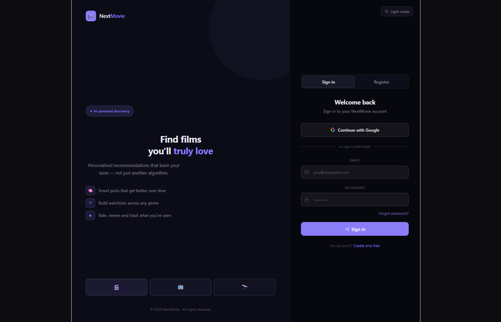
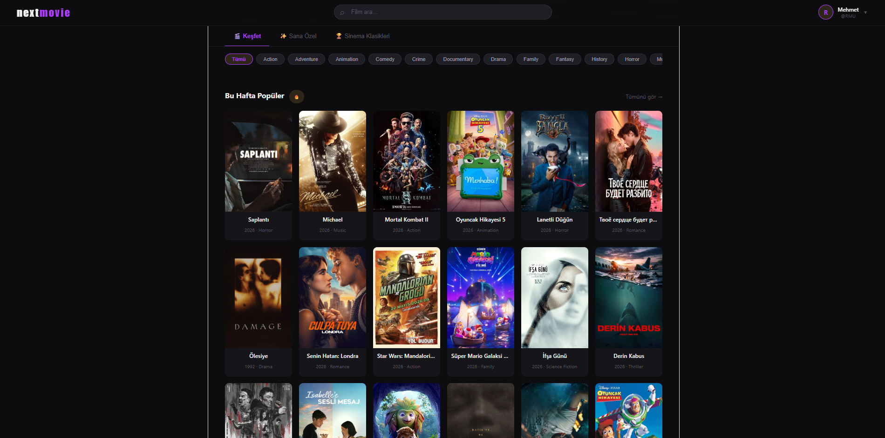
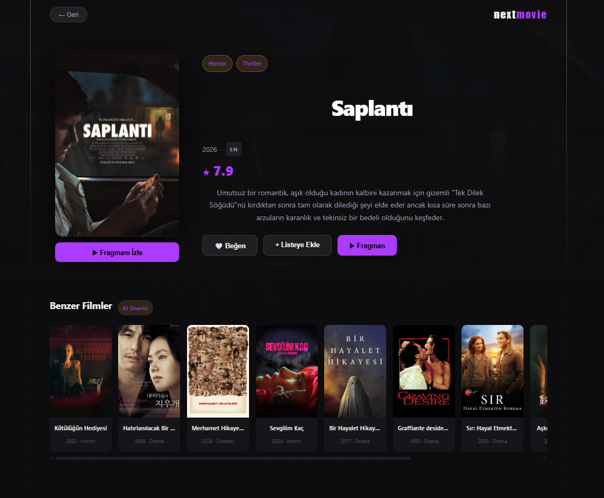
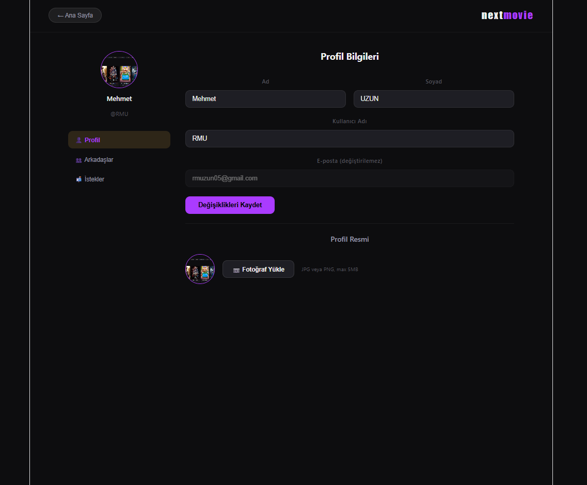

# 🎬 NextMovie

> A full-stack AI-powered movie recommendation platform built with React, Spring Boot, PostgreSQL, Milvus vector database, and a Python FastAPI microservice.


---

## Screenshots

### Login Page


### Homepage — Discover


### Movie Detail & Similar Movies (Module 1)


### Settings & Friend System


---

## What is NextMovie?

NextMovie is a production-oriented movie recommendation platform. Unlike typical demo projects that rely on a single algorithm, NextMovie is built around **three independent intelligent modules**, each targeting a different recommendation problem.

The platform uses **~15.000 real movies** fetched from TMDB, stored in PostgreSQL with vector embeddings in Milvus. The recommendation backbone is a Python FastAPI microservice that runs `sentence-transformers` for semantic understanding and serves similarity queries to the Spring Boot backend.

---

## Recommendation Modules

| # | Module | Approach | Status |
|---|--------|----------|--------|
| 1 | **Content-Based Similarity** | Vector cosine search via Milvus | ✅ Complete |
| 2 | **Personalized Recommendations** | User history + friends + location signals | 🔄 Planned |
| 3 | **Natural Language Search** | Free-text semantic embedding search | 🔄 Planned |

### Module 1 — Content-Based Similarity
When a user opens a movie detail page, the system returns the **10 most similar movies** from the entire catalog.

How it works:
1. Each movie's `title + genres + overview` is embedded using `paraphrase-multilingual-MiniLM-L12-v2` (384-dim)
2. All vectors are stored in Milvus (`nextmovie` database, `movie_vectors` collection, IVF_FLAT index, COSINE metric)
3. On request, Spring Boot sends the `movie_id` to the Python FastAPI service (`POST /similar`)
4. Python retrieves the film's vector from Milvus, runs a cosine similarity search, returns the top-10 IDs
5. Spring Boot fetches those movies from PostgreSQL and returns them as `MovieDTO` list

### Module 2 — Personalized Recommendations *(Planned)*
Will combine multiple signals to produce a ranked list unique to each user:
- User's own rating history → average embedding = "user taste vector" → Milvus search
- Friends' highly-rated movies → pulled from `friendships` + `ratings` tables
- Country/language preference → filtered by `original_language` and `user_preferences`

### Module 3 — Natural Language Search *(Planned)*
The Python service already exposes a `POST /search` endpoint. The frontend will send free-text input (e.g. "90s sci-fi with time travel"), the service embeds it with the same model, and Milvus returns the semantically closest films. This goes beyond keyword matching — it understands intent.

---

## System Architecture

```
┌─────────────────────────────────────────────────────────────────┐
│                        React Frontend  :5173                    │
│   HomePage · MovieDetailPage · SettingsPage · SearchBar         │
└──────────────────────────┬──────────────────────────────────────┘
                           │ REST / JSON + JWT
┌──────────────────────────▼──────────────────────────────────────┐
│                Spring Boot API Gateway  :8080                   │
├────────────────────────────────────────────────────────────────-┤
│  Controllers                                                     │
│  AuthController · MovieController · RecommendationController     │
│  LikeController · WatchlistController · FriendshipController     │
│  ProfileController                                               │
├──────────────────────────────────────────────────────────────────┤
│  Services                                                        │
│  AuthService · MovieService · RecommendationService              │
│  LikeService · WatchlistService · FriendshipService              │
│  TmdbImportService · PythonServiceLauncher                       │
├────────────────────┬─────────────────────────────────────────────┤
│   PostgreSQL :5432 │   HTTP POST → localhost:8001                │
│                    │                                             │
│   users            │  ┌──────────────────────────────────────┐  │
│   movies           │  │   Python FastAPI  :8001              │  │
│   likes            │  │                                      │  │
│   watchlist        │  │   main.py          — API routes      │  │
│   ratings          │  │   embedding_service.py — ST model    │  │
│   friendships      │  │   milvus_service.py    — vector ops  │  │
│   user_preferences │  │   indexer.py           — batch index │  │
│                    │  └──────────────┬───────────────────────┘  │
└────────────────────┘                 │                           │
                                       │ pymilvus SDK              │
                          ┌────────────▼──────────────────────┐   │
                          │      Milvus  :19530  (Docker)     │   │
                          │      database:   nextmovie        │   │
                          │      collection: movie_vectors    │   │
                          │      dim: 384  metric: COSINE     │   │
                          │      index:    IVF_FLAT           │   │
                          └───────────────────────────────────┘   │
                                                                   │
                          ┌────────────────────────────────────┐   │
                          │          TMDB API  (external)      │   │
                          │  /movie/popular · /movie/top_rated │   │
                          │  /movie/{id}/videos (trailers)     │   │
                          │  image CDN: image.tmdb.org/t/p/    │   │
                          └────────────────────────────────────┘
```

---

## Tech Stack

### Backend — Spring Boot
| Technology | Version | Purpose |
|------------|---------|---------|
| Java | 17 | Language |
| Spring Boot | 3.3 | Framework |
| Spring Security | 6 | JWT auth, CORS |
| Spring Data JPA | 3.3 | ORM |
| Hibernate | 6.5 | SQL generation |
| PostgreSQL Driver | — | DB connection |
| RestTemplate | — | HTTP to TMDB + Python service |

### Recommendation Service — Python
| Technology | Version | Purpose |
|------------|---------|---------|
| Python | 3.10+ | Language |
| FastAPI | 0.111 | REST API framework |
| sentence-transformers | 3.0.1 | Embedding model |
| paraphrase-multilingual-MiniLM-L12-v2 | — | 384-dim multilingual model |
| pymilvus | 2.4.3 | Milvus SDK |
| psycopg2 | 2.9.9 | PostgreSQL for batch indexing |
| uvicorn | 0.30.1 | ASGI server |

### Frontend — React
| Technology | Version | Purpose |
|------------|---------|---------|
| React | 18 | UI framework |
| Vite | 5 | Build tool |
| React Router | v6 | Client-side routing |
| Axios | — | HTTP client + JWT interceptor |
| CSS Variables | — | Theming system |

### Infrastructure
| Component | Version | Purpose |
|-----------|---------|---------|
| PostgreSQL | 16 | Primary relational database |
| Milvus | 2.4 | Vector database |
| Docker | — | Milvus container |
| TMDB API | v3 | Movie metadata, posters, trailers |

---

## Project Structure

```
NextMovie/
├── backend/
│   └── src/main/java/com/nextmovie/
│       ├── controller/
│       │   ├── AuthController.java           # /api/auth/login, /register
│       │   ├── MovieController.java          # /api/movies/**
│       │   ├── RecommendationController.java # /api/recommendations/similar/{id}
│       │   ├── LikeController.java           # /api/likes/{movieId}/toggle
│       │   ├── WatchlistController.java      # /api/watchlist/**
│       │   ├── FriendshipController.java     # /api/friends/**
│       │   └── ProfileController.java        # /api/profile/**
│       ├── service/
│       │   ├── AuthService.java
│       │   ├── MovieService.java             # TMDB detail + trailer fetch
│       │   ├── RecommendationService.java    # Calls Python /similar, maps IDs → DTOs
│       │   ├── LikeService.java              # Toggle like
│       │   ├── WatchlistService.java         # Toggle + list
│       │   ├── FriendshipService.java        # Send by username, accept/reject
│       │   ├── TmdbImportService.java        # Auto-import on first startup
│       │   └── PythonServiceLauncher.java    # Starts Python process with Spring Boot
│       ├── entity/
│       │   ├── User.java
│       │   ├── Movie.java                    # backdropPath, voteCount, runtime
│       │   ├── Like.java
│       │   ├── Watchlist.java
│       │   ├── Rating.java
│       │   ├── Friendship.java               # PENDING/ACCEPTED/BLOCKED
│       │   └── UserPreference.java
│       ├── repository/
│       │   ├── MovieRepository.java          # findTop20ByPopularity, search by title
│       │   ├── UserRepository.java           # findByEmail, findByUsername
│       │   ├── LikeRepository.java
│       │   ├── WatchlistRepository.java
│       │   └── FriendshipRepository.java     # JPQL queries for accepted/pending
│       ├── security/
│       │   ├── SecurityConfig.java           # Global CORS, permit all (dev)
│       │   ├── JwtService.java               # Base64 token (dev-grade)
│       │   └── JwtFilter.java
│       └── dto/
│           ├── AuthResponse.java             # token, email, username, name
│           ├── LoginRequest.java
│           ├── RegisterRequest.java
│           ├── MovieDTO.java
│           └── MovieDetailDTO.java           # + trailerKey, backdropPath, liked, inWatchlist
│
├── recommendation-service/
│   ├── main.py                # FastAPI app, /health /similar /search
│   ├── embedding_service.py   # SentenceTransformer, build_text, embed_batch
│   ├── milvus_service.py      # connect, get_or_create_collection, insert, search
│   ├── indexer.py             # Reads PostgreSQL → embeds → writes to Milvus
│   ├── requirements.txt
│   └── .env                   # DB + Milvus + model config
│
└── frontend/
    └── src/
        ├── pages/
        │   ├── Login/
        │   │   ├── Login.jsx              # Register + login tabs, JWT storage
        │   │   └── Login.css
        │   ├── HomePage/
        │   │   ├── HomePage.jsx           # Hero, genre filter, module tabs, search dropdown
        │   │   └── HomePage.css
        │   ├── MovieDetailPage/
        │   │   ├── MovieDetailPage.jsx    # Backdrop, trailer modal, Module 1 similar section
        │   │   └── MovieDetailPage.css
        │   └── SettingsPage/
        │       ├── SettingsPage.jsx       # Profile edit, picture upload, friends, requests
        │       └── SettingsPage.css
        ├── services/
        │   ├── authService.js             # axios instance, JWT interceptor, login/register
        │   └── movieService.js            # movieService, profileService, friendService
        ├── App.jsx                        # BrowserRouter, PrivateRoute, all routes
        └── main.jsx
```

---

## Database Schema

```sql
-- Core user table
users (
  id BIGSERIAL PRIMARY KEY,
  email VARCHAR UNIQUE NOT NULL,
  username VARCHAR UNIQUE NOT NULL,
  name VARCHAR, lastname VARCHAR, password VARCHAR,
  profile_picture VARCHAR,   -- served from /api/profile/picture/{filename}
  country CHAR(2),
  created_at TIMESTAMP, is_active BOOLEAN DEFAULT true
)

-- Movies fetched from TMDB (~15.000 records)
movies (
  id BIGSERIAL PRIMARY KEY,
  tmdb_id INTEGER UNIQUE NOT NULL,
  title VARCHAR(500) NOT NULL,
  overview TEXT,
  genres VARCHAR,            -- "Action,Drama,Thriller"
  keywords VARCHAR,
  poster_path VARCHAR,       -- "/abc123.jpg" → https://image.tmdb.org/t/p/w500{poster_path}
  backdrop_path VARCHAR,
  vote_average DECIMAL(3,1), vote_count INTEGER,
  original_language CHAR(2), release_date DATE,
  popularity DECIMAL, runtime INTEGER,
  created_at TIMESTAMP
)

-- User interactions
likes       ( id, user_id → users, movie_id → movies, created_at )
watchlist   ( id, user_id → users, movie_id → movies, added_at )
ratings     ( id, user_id → users, movie_id → movies, score SMALLINT 1-10, watched_at )

-- Social
friendships (
  id, requester_id → users, addressee_id → users,
  status VARCHAR  -- 'PENDING' | 'ACCEPTED' | 'BLOCKED'
  created_at
)

user_preferences (
  user_id PRIMARY KEY → users,
  preferred_genres VARCHAR, preferred_languages VARCHAR,
  updated_at
)
```

### Milvus Collection

```
database:   nextmovie
collection: movie_vectors
fields:
  movie_id  INT64         (primary key, maps to movies.id in PostgreSQL)
  embedding FLOAT[384]    (paraphrase-multilingual-MiniLM-L12-v2 output)
index:      IVF_FLAT
metric:     COSINE
nlist:      128
```

---

## Getting Started

### Prerequisites

- Java 17+
- Node.js 18+
- Python 3.10+
- PostgreSQL 16+
- Docker
- TMDB API Key → [themoviedb.org/settings/api](https://www.themoviedb.org/settings/api)

---

### Step 1 — Start Milvus

```bash
docker run -d --name milvus \
  -p 19530:19530 -p 9091:9091 \
  milvusdb/milvus:v2.4.0 standalone
```

---

### Step 2 — Configure and Run Backend

`backend/src/main/resources/application.properties`:

```properties
spring.datasource.url=jdbc:postgresql://localhost:5432/nextmovie
spring.datasource.username=YOUR_DB_USER
spring.datasource.password=YOUR_DB_PASSWORD
spring.jpa.hibernate.ddl-auto=update

tmdb.api.key=YOUR_TMDB_API_KEY
recommendation.service.url=http://localhost:8001

spring.servlet.multipart.max-file-size=10MB
spring.servlet.multipart.max-request-size=10MB
```

```bash
cd backend
./mvnw spring-boot:run
```

On first startup, `TmdbImportService` automatically fetches ~15.000 movies from TMDB (`/movie/popular` + `/movie/top_rated`, 250 pages each) and saves them to PostgreSQL. Subsequent restarts skip the import.

---

### Step 3 — Set Up Recommendation Service

```bash
cd recommendation-service
pip install -r requirements.txt
```

Edit `.env`:

```env
DB_HOST=localhost
DB_PORT=5432
DB_NAME=nextmovie
DB_USER=postgres
DB_PASSWORD=YOUR_DB_PASSWORD

MILVUS_HOST=localhost
MILVUS_PORT=19530
MILVUS_DB=nextmovie

EMBEDDING_MODEL=paraphrase-multilingual-MiniLM-L12-v2
EMBEDDING_DIM=384
SERVICE_PORT=8001
```

**Index movies into Milvus** (run once, ~15 minutes for 15.000 films):

```bash
python indexer.py
```

The indexer reads all movies from PostgreSQL, builds embeddings in batches of 256, and writes them to Milvus. Already-indexed films are skipped on re-runs. To force a full re-index:

```bash
python indexer.py --reset
```

**Start the service:**

```bash
python main.py
# or
uvicorn main:app --host 0.0.0.0 --port 8001 --reload
```

Verify: `http://localhost:8001/health` → `{"status":"ok","vectors":15000}`

---

### Step 4 — Run Frontend

```bash
cd frontend
```

Create `.env` in the frontend root:

```env
VITE_API_URL=http://localhost:8080/api
```

```bash
npm install
npm run dev
```

Open `http://localhost:5173`

---

## API Reference

### Auth

| Method | Endpoint | Body | Response |
|--------|----------|------|----------|
| POST | `/api/auth/register` | `{name, lastname, email, password, username}` | `"User registered"` |
| POST | `/api/auth/login` | `{email, password}` | `{token, email, username, name}` |

### Movies

| Method | Endpoint | Auth | Description |
|--------|----------|------|-------------|
| GET | `/api/movies/popular` | No | Top 20 by popularity |
| GET | `/api/movies/top-rated` | No | Top 20 by vote average |
| GET | `/api/movies/trending` | No | Top 20 by popularity (same as popular, will diverge in Phase 4) |
| GET | `/api/movies/search?q=` | No | Title search, top 10 by popularity |
| GET | `/api/movies/{id}` | Optional | Full detail + trailerKey + liked + inWatchlist |

### Recommendations

| Method | Endpoint | Auth | Description |
|--------|----------|------|-------------|
| GET | `/api/recommendations/similar/{id}?topK=10` | No | Module 1: top-K similar movies via Milvus |

### User Interactions

| Method | Endpoint | Auth | Description |
|--------|----------|------|-------------|
| POST | `/api/likes/{movieId}/toggle` | Yes | Toggle like, returns `{liked: bool}` |
| GET | `/api/watchlist` | Yes | User's watchlist as MovieDTO list |
| POST | `/api/watchlist/{movieId}/toggle` | Yes | Toggle watchlist, returns `{inWatchlist: bool}` |

### Profile

| Method | Endpoint | Auth | Description |
|--------|----------|------|-------------|
| GET | `/api/profile` | Yes | Get current user profile |
| PUT | `/api/profile` | Yes | Update name, lastname, username |
| POST | `/api/profile/picture` | Yes | Upload profile picture (multipart) |
| GET | `/api/profile/picture/{filename}` | No | Serve profile picture |

### Friends

| Method | Endpoint | Auth | Description |
|--------|----------|------|-------------|
| GET | `/api/friends` | Yes | Accepted friends list |
| GET | `/api/friends/pending` | Yes | Incoming pending requests |
| POST | `/api/friends/request?username=` | Yes | Send request by username |
| POST | `/api/friends/respond/{id}?accept=true` | Yes | Accept or reject request |

---

## Recommendation Service API

Base URL: `http://localhost:8001`

| Method | Endpoint | Body | Description |
|--------|----------|------|-------------|
| GET | `/health` | — | Service status + vector count |
| POST | `/similar` | `{movie_id, top_k}` | Module 1: cosine search in Milvus |
| POST | `/search` | `{query, top_k}` | Module 3: embed free text → Milvus search |

---

## Key Implementation Notes

**Token format:** The current `JwtService` uses Base64-encoded email as the token. This is development-grade and should be replaced with proper HMAC-signed JWT before production.

**TMDB image URLs:** Posters are never stored locally. The `poster_path` field (e.g. `/abc123.jpg`) is combined with `https://image.tmdb.org/t/p/w500` on the frontend at render time.

**Trailer resolution:** On movie detail requests, Spring Boot calls TMDB `/movie/{id}/videos` first in Turkish, then falls back to English. Returns the first YouTube `Trailer` type key.

**Milvus ID mapping:** Milvus stores `movie_id` as the primary key, which is the `movies.id` from PostgreSQL (not `tmdb_id`). This allows direct `findAllById` lookups without an extra join.

**Similarity ordering:** The Python service preserves cosine similarity ranking order. `RecommendationService.java` maps IDs back to entities using a `Map<Long, Movie>` to maintain that order in the response.

**Python process lifecycle:** `PythonServiceLauncher.java` starts the Python process using `ProcessBuilder` on `ApplicationReadyEvent` and destroys it on `@PreDestroy`. Stdout/stderr are forwarded to the Spring Boot console via `inheritIO()`.

---

## Roadmap

```
Phase 1 — Foundation           ✅  Auth · DB schema · TMDB import · Homepage UI
Phase 2 — Recommendation Core  ✅  Milvus setup · embeddings · Module 1 (content-based)
Phase 3 — Social & Profile     ✅  Friends · Likes · Watchlist · Settings · Profile picture
Phase 4 — Advanced Modules     🔄  Module 2 (personalized) · Module 3 (NL search)
Phase 5 — Production           ⏳  Docker Compose · proper JWT · CI/CD · deployment
```

---

## Environment Variables Summary

| Variable | File | Description |
|----------|------|-------------|
| `tmdb.api.key` | `application.properties` | TMDB v3 API key |
| `spring.datasource.url` | `application.properties` | PostgreSQL JDBC URL |
| `spring.datasource.username` | `application.properties` | DB username |
| `spring.datasource.password` | `application.properties` | DB password |
| `recommendation.service.url` | `application.properties` | Python FastAPI base URL |
| `VITE_API_URL` | `frontend/.env` | Spring Boot API base URL |
| `DB_HOST` | `recommendation-service/.env` | PostgreSQL host |
| `DB_PASSWORD` | `recommendation-service/.env` | PostgreSQL password |
| `MILVUS_HOST` | `recommendation-service/.env` | Milvus host |
| `MILVUS_PORT` | `recommendation-service/.env` | Milvus port (default 19530) |
| `MILVUS_DB` | `recommendation-service/.env` | Milvus database name |
| `SERVICE_PORT` | `recommendation-service/.env` | FastAPI port (default 8001) |

---

## License

MIT License — feel free to use, modify, and distribute.